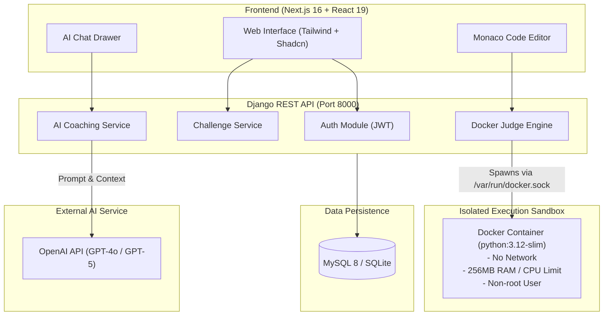
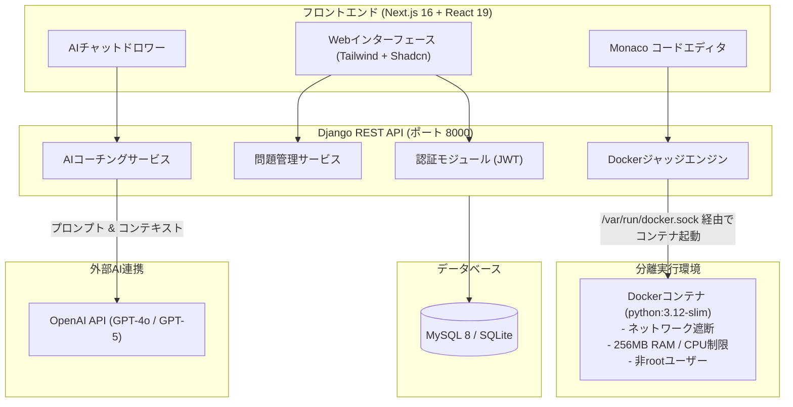

# gPBL - AI-Assisted Online Coding Challenge Platform
# AIアシスト型オンラインプログラミング学習・判定プラットフォーム

[](https://www.python.org/)
[](https://www.djangoproject.com/)
[](https://nextjs.org/)
[](https://react.dev/)
[](https://www.docker.com/)
[](https://openai.com/)

---

## 🌐 Language Navigation / 言語切替
- [English Documentation](#-english)
- [日本語ドキュメント](#-日本語-japanese)

---

# 🇬🇧 English

## 📖 Overview
**gPBL (Global Problem-Based Learning)** is an intelligent online coding challenge and judge platform designed for Python learning and competitive programming.

It combines a **secure Docker-based execution sandbox**, an **interactive browser-based IDE (Monaco Editor)**, and a **Socratic AI Coding Coach** powered by OpenAI. Rather than simply giving away solutions, the AI coach analyzes the user's current code snapshots, detects misunderstandings, and delivers progressive, step-by-step guidance in English, Japanese, and Vietnamese.

---

## ✨ Key Features

- 🤖 **Socratic AI Coding Coach**:
  - Context-aware hint generation based on the active challenge description, current code draft, and conversation history.
  - Progressive guidance that adapts to user understanding without spoiling full code solutions.
  - Code comprehension assessment and lock mechanisms before unlocking further hints.
  - Multilingual support: English, Japanese (日本語), and Vietnamese (Tiếng Việt).
- ⚖️ **Isolated Docker Judge Engine**:
  - Sandboxed execution inside dedicated lightweight containers (`python:3.12-slim`).
  - Strict resource limits: 256MB memory cap, CPU quota, PID limits (anti-fork-bomb), read-only `tmpfs`, non-root execution (`nobody`), and disabled network access (`--network=none`).
  - Comprehensive verdict support: `AC` (Accepted), `WA` (Wrong Answer), `TLE` (Time Limit Exceeded), `CE` (Compile Error), `RE` (Runtime Error), `IE` (Internal Error).
  - Public sample test cases and hidden evaluation test cases.
- 💻 **Modern Web IDE**:
  - Powered by Next.js 16 (App Router), React 19, and Tailwind CSS v4.
  - Full-featured Monaco code editor with custom themes, font resizing, and language selection.
  - Resizable panel workspace (Problem Description, Editor, Console Output, AI Drawer).
- 🏆 **Gamification & User Profiles**:
  - Real-time Leaderboard with global scoring and user rankings.
  - User activity heatmap / submission calendar, avatar selector, and detailed submission history.
- 🔐 **Secure Authentication**:
  - JWT authentication (`djangorestframework-simplejwt`) with automatic token refresh.

---

## 🏗️ System Architecture



---

## 🛠️ Tech Stack

| Layer | Technologies |
|---|---|
| **Frontend** | Next.js 16 (App Router), React 19, TypeScript, Monaco Editor, Tailwind CSS v4, Shadcn UI / Radix UI, TanStack Query, Lucide Icons |
| **Backend** | Python 3.12, Django 6.1, Django REST Framework (DRF), `djangorestframework-simplejwt` |
| **Judge Engine** | `docker-py` (Docker SDK for Python), Isolated `python:3.12-slim` sandboxes |
| **AI Integration** | OpenAI Python SDK (`openai>=1.54.4`), Prompt Engineering & Socratic Tutoring Logic |
| **Database** | MySQL 8 (Production) / SQLite (Development) |
| **DevOps / Tooling** | Docker, Docker Compose, GNU Make |

---

## 🚀 Getting Started

### Prerequisites
- **Python 3.12+**
- **Node.js 20+** and **npm** / **pnpm** / **yarn**
- **Docker** and Docker daemon running (required for Judge Engine)
- **MySQL 8** (or use local SQLite for quick start)
- **OpenAI API Key** (for AI coach functionality)

---

### 1. Clone the Repository
```bash
git clone https://github.com/Shiirororo/gPBL.git
cd gPBL
```

---

### 2. Backend Setup (Django)

1. **Create and activate a virtual environment:**
   ```bash
   python3 -m venv venv
   source venv/bin/activate  # On Windows: venv\Scripts\activate
   ```

2. **Install Python dependencies:**
   ```bash
   pip install -r requirements.txt
   ```

3. **Configure Environment Variables (`.env`):**
   Create a `.env` file in the project root:
   ```env
   SECRET_KEY=your-django-secret-key
   DEBUG=True
   ALLOWED_HOSTS=localhost,127.0.0.1,0.0.0.0

   # Database (MySQL or leave unset for SQLite development)
   DB_NAME=gpbl_db
   DB_USER=gpbl_user
   DB_PASSWORD=your_db_password
   DB_HOST=127.0.0.1
   DB_PORT=3306

   # OpenAI Configuration
   OPEN_AI_KEY=sk-proj-xxxxxxxxxxxxxxxxxxxxxxxx
   OPEN_AI_MODEL=gpt-4o
   ```

4. **Run Migrations & Seed Sample Challenges:**
   ```bash
   cd src
   python manage.py migrate
   python create_sample_data.py   # Optional: populate challenge dataset
   ```

5. **Start Django Server:**
   ```bash
   python manage.py runserver 0.0.0.0:8000
   ```

---

### 3. Frontend Setup (Next.js)

1. **Navigate to the frontend folder:**
   ```bash
   cd frontend
   ```

2. **Install Node dependencies:**
   ```bash
   npm install
   ```

3. **Configure Frontend Environment (`frontend/.env.local`):**
   ```env
   NEXT_PUBLIC_API_URL=http://localhost:8000/api
   ```

4. **Start the Frontend Development Server:**
   ```bash
   npm run dev
   ```
   Open [http://localhost:3000](http://localhost:3000) in your browser.

---

### 4. Running Backend via Docker

Because the Judge Engine spawns isolated execution containers dynamically, you must **mount the Docker socket** (`/var/run/docker.sock`):

```bash
# 1. Build the Docker Image
docker build -t gpbl-backend .

# 2. Run the Container with Docker Socket Mounted
docker run -d \
  --name gpbl_server \
  -p 8000:8000 \
  --env-file .env \
  -v /var/run/docker.sock:/var/run/docker.sock \
  gpbl-backend
```

---

## 📂 Project Structure

```text
gPBL/
├── core/                        # Django Application Business Logic
│   ├── ai/                      # AI Coaching services, prompt templates & assessment
│   ├── assessments/             # Assessment validation & unlocks
│   ├── auth/                    # JWT Authentication endpoints & serializers
│   ├── challenge/               # Coding challenge management & APIs
│   ├── judge/                   # Docker Judge execution engine & evaluation logic
│   ├── submissions/             # Submission histories & test case verdict handlers
│   └── user/                    # User profile, statistics & leaderboard
├── frontend/                    # Next.js 16 Web Application
│   ├── app/                     # App Router pages & Next.js API proxy routes
│   │   ├── (auth)/              # Login and registration pages
│   │   └── (main)/              # Challenges, workspace, leaderboard, profile
│   ├── components/              # Monaco Editor, ChatBox, Modals, UI widgets
│   ├── lib/                     # API fetch utilities & state management
│   └── styles/                  # Tailwind CSS styling
├── docs/                        # Architecture & API documentation
├── src/                         # Django settings, root URLs, and manage.py
│   ├── config/                  # Django settings (ASGI, WSGI, URLs, settings.py)
│   └── manage.py                # Django CLI entrypoint
├── Dockerfile                   # Backend Docker build instructions
├── Makefile                     # Quick testing commands (register, login, submit)
├── requirements.txt             # Backend Python dependencies
└── README.md                    # Project documentation
```

---

## 📡 API Overview

| Method | Endpoint | Description | Auth Required |
|---|---|---|:---:|
| `POST` | `/api/auth/register/` | Register new user account | No |
| `POST` | `/api/auth/login/` | Obtain JWT access & refresh tokens | No |
| `POST` | `/api/auth/refresh/` | Refresh expired access token | No |
| `GET` | `/api/challenges/` | List all available coding challenges | Optional |
| `GET` | `/api/challenge/<id>/` | Get challenge detail & public test cases | Optional |
| `POST` | `/api/challenge/<id>/submit/` | Submit Python code to the Judge Sandbox | **Yes** |
| `GET` | `/api/challenge/<id>/submissions/` | List user's submissions for a challenge | **Yes** |
| `POST` | `/api/ai/hint/` | Request contextual AI hint for current code draft | **Yes** |
| `POST` | `/api/ai/assess/` | Submit quiz/assessment response to unlock hints | **Yes** |
| `GET` | `/api/leaderboard/` | Get global user ranking & scores | No |
| `GET` | `/api/user/profile/` | Get authenticated user profile & stats | **Yes** |

*(For full endpoint contracts and payload examples, refer to [docs/API_Documentation_v1.md](file:///home/shiro/Desktop/Project/gPBL/docs/API_Documentation_v1.md))*

---
<br>

---

# 🇯🇵 日本語 (Japanese)

## 📖 プロジェクト概要
**gPBL (Global Problem-Based Learning)** は、Pythonプログラミング学習および競技プログラミングのための**AIアシスト型オンラインジャッジプラットフォーム**です。

**Dockerによる安全なサンドボックス実行環境**、ブラウザ上で動作する**高機能Web IDE（Monaco Editor）**、そしてOpenAIを活用した**ソクラテス式AIコーディングコーチ**を統合しています。単に正解コードを出力するのではなく、ユーザーが記述中のコードスナップショットや過去の対話履歴を分析し、理解度に応じた段階的なヒントを日本語・英語・ベトナム語で提供します。

---

## ✨ 主な機能

- 🤖 **ソクラテス式 AIコーディングコーチ**:
  - 問題文、現在のコードスナップショット、対話履歴をコンテキストとして段階的なヒントを提示。
  - すぐに答えを教えず、受講者の気付きを促す教育的プロンプト設計。
  - 理解度確認クイズ（アセスメント）によるヒントアンロック機能。
  - 多言語対応：日本語・英語・ベトナム語。
- ⚖️ **Docker分離型 ジャッジエンジン**:
  - 軽量コンテナ（`python:3.12-slim`）内で提出コードを安全に実行。
  - 厳格なリソース制限：メモリ256MB上限、CPUクォータ制限、PID制限（フォークボム防止）、読み取り専用ファイルシステム（tmpfs）、非root実行（`nobody`）、ネットワーク遮断（`--network=none`）。
  - 各種判定ステータス：`AC` (正解), `WA` (不正解), `TLE` (時間超過), `CE` (コンパイルエラー), `RE` (実行時エラー), `IE` (内部エラー)。
  - 公開サンプルケースおよび隠しテストケースの検証。
- 💻 **モダンなWeb IDE**:
  - Next.js 16 (App Router) + React 19 + Tailwind CSS v4による高速で美しいUI。
  - Monaco Editorによるシンタックスハイライト、フォントサイズ変更、言語切替。
  - 問題文・エディタ・コンソール・AIチャットを自由にリサイズ可能なマルチパネルレイアウト。
- 🏆 **ランキング & ユーザープロファイル**:
  - リアルタイムリーダーボード（スコアランキング）。
  - 草グラフ（提出履歴アクティビティカレンダー）、アバター設定、提出履歴詳細表示。
- 🔐 **セキュアな認証**:
  - SimpleJWTによるアクセストークン／リフレッシュトークン管理。

---

## 🏗️ システム構成図



---

## 🛠️ 技術スタック

| レイヤー | 使用技術 |
|---|---|
| **フロントエンド** | Next.js 16 (App Router), React 19, TypeScript, Monaco Editor, Tailwind CSS v4, Shadcn UI / Radix UI, TanStack Query, Lucide Icons |
| **バックエンド** | Python 3.12, Django 6.1, Django REST Framework (DRF), `djangorestframework-simplejwt` |
| **ジャッジエンジン** | `docker-py` (Docker SDK for Python), 分離型 `python:3.12-slim` サンドボックス |
| **AI連携** | OpenAI Python SDK (`openai>=1.54.4`), プロンプトエンジニアリング・ソクラテス式指導ロジック |
| **データベース** | MySQL 8 (本番環境) / SQLite (ローカル開発環境) |
| **ツール / DevOps** | Docker, Docker Compose, GNU Make |

---

## 🚀 セットアップ手順

### 前提条件
- **Python 3.12+**
- **Node.js 20+** および **npm** / **pnpm** / **yarn**
- **Docker**（ジャッジエンジンのコンテナ実行に必須）
- **MySQL 8**（ローカル開発時はSQLiteでも可）
- **OpenAI API Key**（AIコーチング機能を利用する場合）

---

### 1. リポジトリのクローン
```bash
git clone https://github.com/Shiirororo/gPBL.git
cd gPBL
```

---

### 2. バックエンドのセットアップ (Django)

1. **仮想環境の作成と有効化:**
   ```bash
   python3 -m venv venv
   source venv/bin/activate  # Windowsの場合: venv\Scripts\activate
   ```

2. **依存パッケージのインストール:**
   ```bash
   pip install -r requirements.txt
   ```

3. **環境変数ファイル（`.env`）の設定:**
   プロジェクトルートに `.env` ファイルを作成します:
   ```env
   SECRET_KEY=your-django-secret-key
   DEBUG=True
   ALLOWED_HOSTS=localhost,127.0.0.1,0.0.0.0

   # データベース設定 (未設定の場合はデフォルトでSQLiteを使用)
   DB_NAME=gpbl_db
   DB_USER=gpbl_user
   DB_PASSWORD=your_db_password
   DB_HOST=127.0.0.1
   DB_PORT=3306

   # OpenAI API設定
   OPEN_AI_KEY=sk-proj-xxxxxxxxxxxxxxxxxxxxxxxx
   OPEN_AI_MODEL=gpt-4o
   ```

4. **マイグレーションの実行とサンプルデータの作成:**
   ```bash
   cd src
   python manage.py migrate
   python create_sample_data.py   # サンプル問題データの自動登録（任意）
   ```

5. **Djangoサーバーの起動:**
   ```bash
   python manage.py runserver 0.0.0.0:8000
   ```

---

### 3. フロントエンドのセットアップ (Next.js)

1. **frontendディレクトリへ移動:**
   ```bash
   cd frontend
   ```

2. **パッケージのインストール:**
   ```bash
   npm install
   ```

3. **環境変数ファイル（`frontend/.env.local`）の設定:**
   ```env
   NEXT_PUBLIC_API_URL=http://localhost:8000/api
   ```

4. **開発用サーバーの起動:**
   ```bash
   npm run dev
   ```
   ブラウザで [http://localhost:3000](http://localhost:3000) にアクセスします。

---

### 4. Dockerを使ったバックエンドの起動

ジャッジエンジンがホストのDockerデーモン経由で安全な子コンテナを生成するため、**Dockerソケット (`/var/run/docker.sock`) のマウント**が必要です:

```bash
# 1. Dockerイメージのビルド
docker build -t gpbl-backend .

# 2. Dockerソケットをマウントしてコンテナ起動
docker run -d \
  --name gpbl_server \
  -p 8000:8000 \
  --env-file .env \
  -v /var/run/docker.sock:/var/run/docker.sock \
  gpbl-backend
```

---

## 📂 ディレクトリ構成

```text
gPBL/
├── core/                        # Django アプリケーションロジック
│   ├── ai/                      # AIコーチングサービス・プロンプト・アセスメント
│   ├── assessments/             # アセスメント判定およびアンロック処理
│   ├── auth/                    # JWT認証API・シリアライザ
│   ├── challenge/               # プログラミング課題管理API
│   ├── judge/                   # Dockerサンドボックス実行・ジャッジ評価ロジック
│   ├── submissions/             # 提出コードの履歴管理・テストケース判定
│   └── user/                    # ユーザープロファイル・ランキング
├── frontend/                    # Next.js 16 Webアプリケーション
│   ├── app/                     # App Router ページ・APIプロキシ
│   │   ├── (auth)/              # ログイン・新規登録ページ
│   │   └── (main)/              # 課題一覧、ワークスペース、ランキング、マイページ
│   ├── components/              # Monaco Editor、チャット、モーダル、UI部品
│   ├── lib/                     # API通信ユーティリティ、状態管理
│   └── styles/                  # Tailwind CSSスタイル定義
├── docs/                        # システム設計書・API仕様書
├── src/                         # Django 設定ファイル・ルーティング・manage.py
│   ├── config/                  # Django共通設定 (ASGI, WSGI, URLs, settings.py)
│   └── manage.py                # Django CLI エントリポイント
├── Dockerfile                   # バックエンド用 Dockerfile
├── Makefile                     # 簡易APIテスト用コマンド (register, login, submit等)
├── requirements.txt             # バックエンド Python依存関係
└── README.md                    # 本ドキュメント
```

---

## 📡 主な API エンドポイント一覧

| メソッド | エンドポイント | 説明 | 認証 |
|---|---|---|:---:|
| `POST` | `/api/auth/register/` | ユーザー新規登録 | 不要 |
| `POST` | `/api/auth/login/` | ログイン (アクセストークン/リフレッシュトークン取得) | 不要 |
| `POST` | `/api/auth/refresh/` | アクセストークンの更新 | 不要 |
| `GET` | `/api/challenges/` | 課題一覧の取得 | 任意 |
| `GET` | `/api/challenge/<id>/` | 課題詳細・公開テストケースの取得 | 任意 |
| `POST` | `/api/challenge/<id>/submit/` | コード提出 & ジャッジサンドボックス実行 | **必須** |
| `GET` | `/api/challenge/<id>/submissions/` | 該当課題の提出履歴一覧取得 | **必須** |
| `POST` | `/api/ai/hint/` | 現在のコードに基づいたAIヒントの取得 | **Yes** |
| `POST` | `/api/ai/assess/` | 理解度確認テスト回答・ヒントアンロック | **Yes** |
| `GET` | `/api/leaderboard/` | 全体ランキング・スコア情報の取得 | 不要 |
| `GET` | `/api/user/profile/` | ログイン中ユーザーのプロファイル・統計情報取得 | **必須** |

*(より詳細なAPI仕様については [docs/API_Documentation_v1.md](file:///home/shiro/Desktop/Project/gPBL/docs/API_Documentation_v1.md) をご参照ください)*

---

## 📄 ライセンス
This project is developed for Global Problem-Based Learning (gPBL).
All rights reserved.
