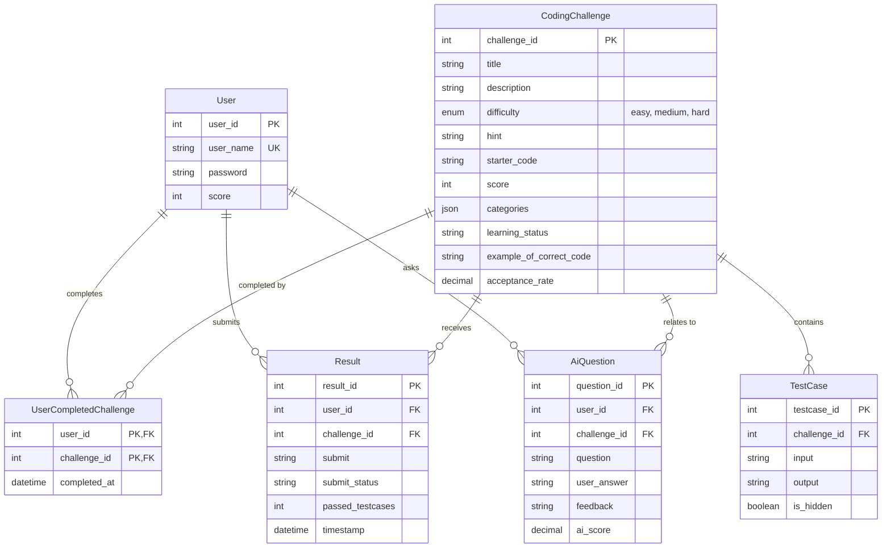

# Comprehensive Codebase Analysis Report: gPBL

## 1. Executive Summary

- **Project Name**: gPBL (Global Problem-Based Learning / Group PBL Coding Platform)
- **Project Type**: AI-Assisted Online Coding Challenge & Competitive Programming Platform Backend
- **Core Stack**: Python 3.10+, Django 6.1, Django REST Framework (DRF), SimpleJWT, MySQL 8+, OpenAI API

The **gPBL** project serves as the backend platform for an interactive, AI-enhanced competitive programming system. It enables user authentication, problem exploration, code submission evaluation, and AI-driven tutoring/assessment.

---

## 2. System Architecture & Project Structure

The project follows a standard Django project layout with `src/` acting as the Django execution root and `core/` encapsulating domain models and business logic modules.

```
gPBL/
├── .env                  # Active environment configuration
├── .env.sample           # Template for environment variables
├── .gitignore            # Git ignore definitions
├── requirements.txt      # Python dependencies manifest
├── docs/                 # Documentation directory
│   ├── [JP]PullRequest.md              # Git & PR workflow guide (Japanese)
│   ├── [VN+JP]Init.md                 # Project initialization guide (VN/JP)
│   ├── [VN]HowToMakeAPullRequest.md   # PR guidelines (Vietnamese)
│   └── CODEBASE_ANALYSIS.md           # System Architecture & Codebase Analysis Report
├── src/                  # Django execution root
│   ├── manage.py         # Entry point for Django CLI
│   ├── db.sqlite3        # Local fallback SQLite database
│   └── config/           # Central Django configuration
│       ├── asgi.py       # ASGI entry point
│       ├── wsgi.py       # WSGI entry point
│       ├── urls.py       # Root URL routing dispatcher
│       └── settings.py   # Global settings & DB config
└── core/                 # Primary Django Application (`core`)
    ├── models.py         # ORM Data Models
    ├── apps.py           # Application configuration
    ├── ai/               # AI integration submodule (stubs)
    ├── auth/             # Authentication API submodule
    │   ├── serializers.py
    │   ├── urls.py
    │   └── views.py
    ├── challenge/        # Coding challenge submodule (stubs)
    ├── user/             # User management submodule (stubs)
    └── migrations/       # Schema migration scripts
        └── migration.sql # Raw MySQL 8 DDL script
```

---

## 3. Database Schema & Data Models

The data layer is defined via Django ORM in [`core/models.py`](file:///home/shiro/Desktop/Project/gPBL/core/models.py) and mapped via MySQL 8 DDL in [`core/migrations/migration.sql`](file:///home/shiro/Desktop/Project/gPBL/core/migrations/migration.sql).



### Table Specifications
1. **`User` (`users`)**: Stores user accounts, credentials, and cumulative score.
2. **`CodingChallenge` (`coding_challenges`)**: Stores problem statements, difficulty levels, sample code, hints, and JSON categories. Indexed on `difficulty` and `learning_status`.
3. **`TestCase` (`test_cases`)**: Holds test inputs and expected outputs for evaluating user submissions, supporting hidden test cases.
4. **`UserCompletedChallenge` (`user_completed_challenges`)**: Junction table recording user-completed challenges with composite primary key `(user_id, challenge_id)`.
5. **`Result` (`results`)**: Records submission code, pass/fail status, and count of passed test cases.
6. **`AiQuestion` (`ai_questions`)**: Stores interactive AI tutoring sessions, questions, user answers, AI feedback, and evaluated scores.

---

## 4. API Endpoints & Authentication

Authentication is handled via standard JWT (`djangorestframework-simplejwt`).

| HTTP Method | Route | Endpoint Handler | Description |
| :--- | :--- | :--- | :--- |
| `POST` | `/api/auth/register/` | [`RegisterView`](file:///home/shiro/Desktop/Project/gPBL/core/auth/views.py#L8-L16) | Registers a new user |
| `POST` | `/api/auth/login/` | `TokenObtainPairView` | Authenticates user & returns JWT access/refresh pair |
| `POST` | `/api/auth/refresh/` | `TokenRefreshView` | Refreshes expired JWT access token |
| `GET/POST` | `/admin/` | Admin Dashboard | Standard Django admin interface |

---

## 5. Technical Debt & Missing Components

During audit, the following critical issues and missing implementations were identified:

1. **User Model Inconsistency**:
   - [`core/models.py`](file:///home/shiro/Desktop/Project/gPBL/core/models.py) defines custom `User` table (`users`).
   - [`core/auth/serializers.py`](file:///home/shiro/Desktop/Project/gPBL/core/auth/serializers.py) imports built-in `django.contrib.auth.models.User` (`auth_user`).
   - `AUTH_USER_MODEL = 'core.User'` is missing in [`src/config/settings.py`](file:///home/shiro/Desktop/Project/gPBL/src/config/settings.py).
2. **Unimplemented Core Submodules**:
   - `core/ai/`: Unimplemented stub directory for OpenAI prompt evaluation.
   - `core/challenge/`: Missing code sandbox evaluation runner and test case checker.
   - `core/user/`: Missing leaderboard and profile endpoints.
3. **Dependency Cleanliness**:
   - Duplications in [`requirements.txt`](file:///home/shiro/Desktop/Project/gPBL/requirements.txt) (`asgiref`, `django`, `sqlparse`).
4. **Documentation Artifacts**:
   - [`docs/[JP]PullRequest.md`](file:///home/shiro/Desktop/Project/gPBL/docs/[JP]PullRequest.md) contains leftover Go code snippets (`c.JSON(...)`).
   - [`docs/[VN]HowToMakeAPullRequest.md`](file:///home/shiro/Desktop/Project/gPBL/docs/[VN]HowToMakeAPullRequest.md) references `RSA.git` instead of `gPBL.git`.

---

## 6. Recommendations & Action Plan

1. Align the authentication module by setting custom `AUTH_USER_MODEL` or configuring standard Django user serializer.
2. Implement code sandbox execution pipeline for evaluating submissions in `core/challenge/`.
3. Implement OpenAI API integration for tutoring feedback in `core/ai/`.
4. Clean up `requirements.txt` duplicate packages and fix documentation typos.
